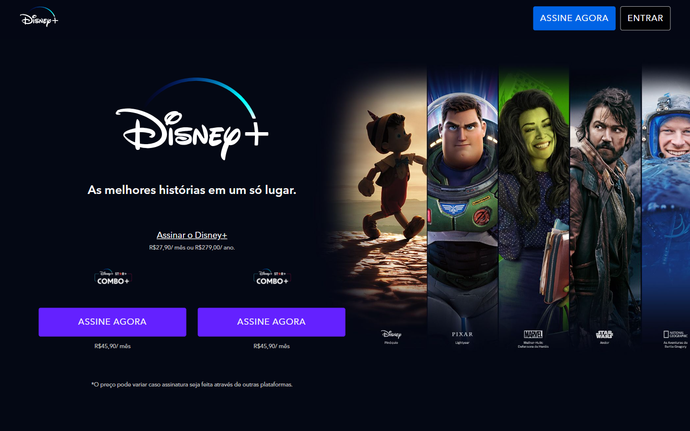
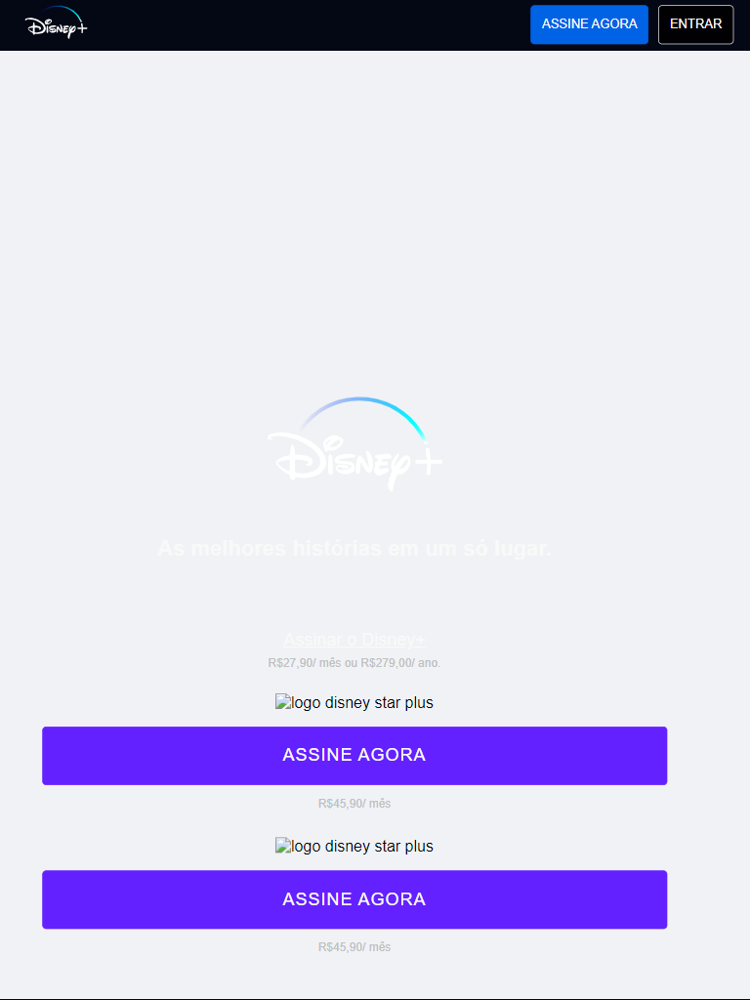
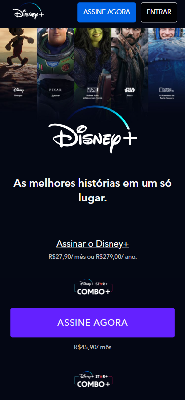
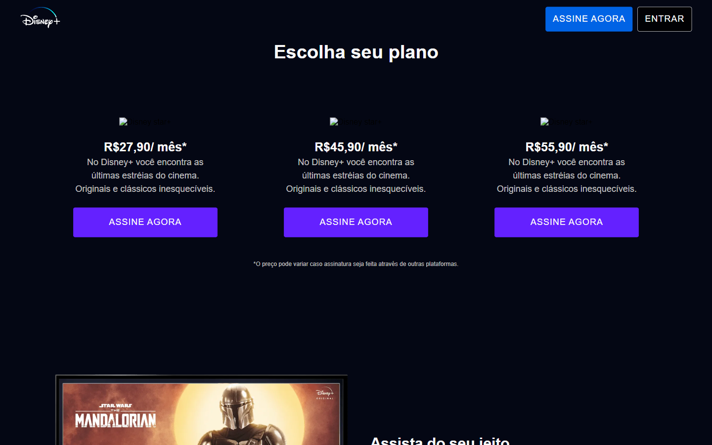
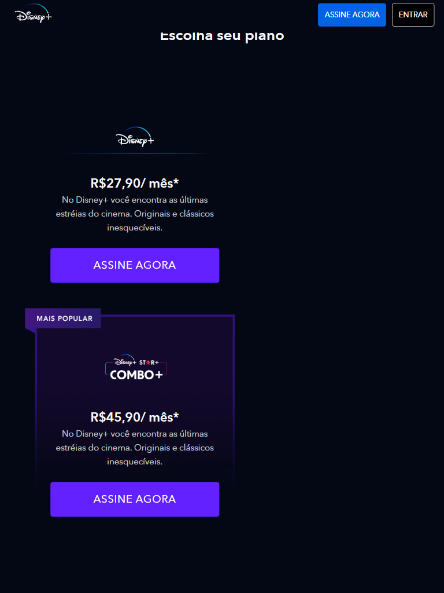
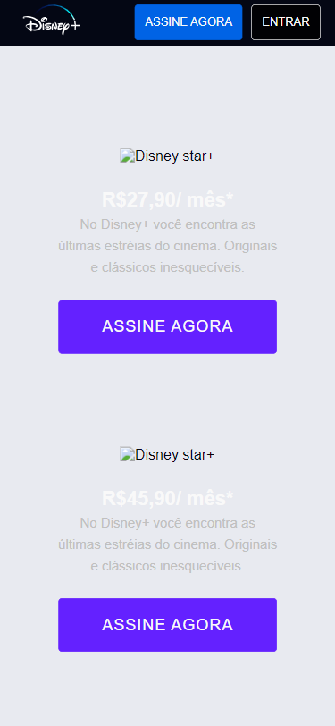
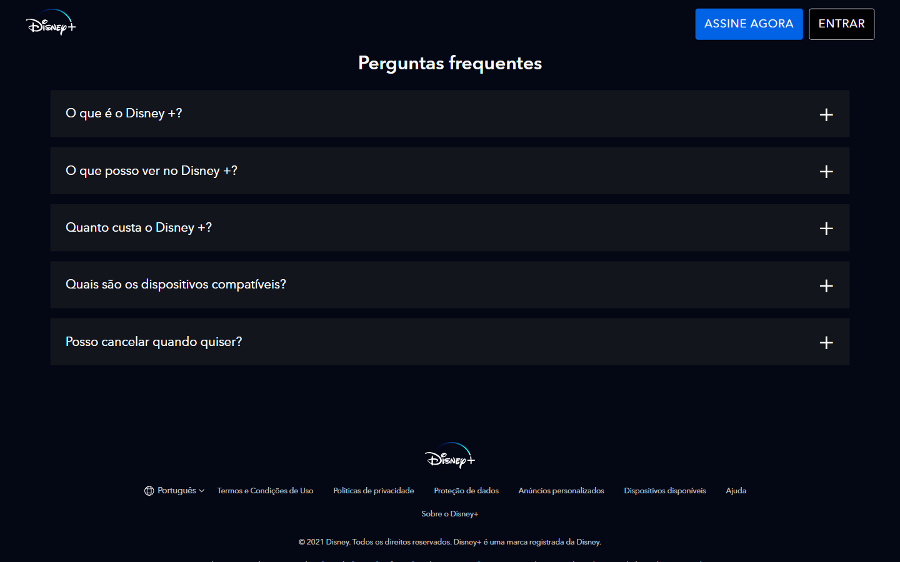
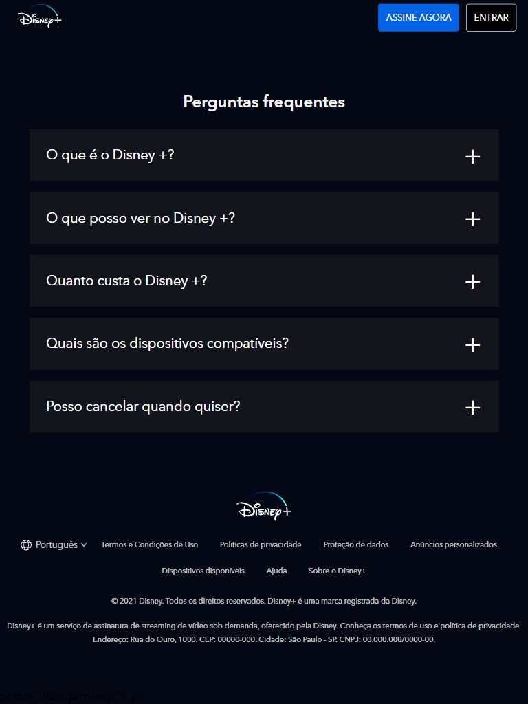
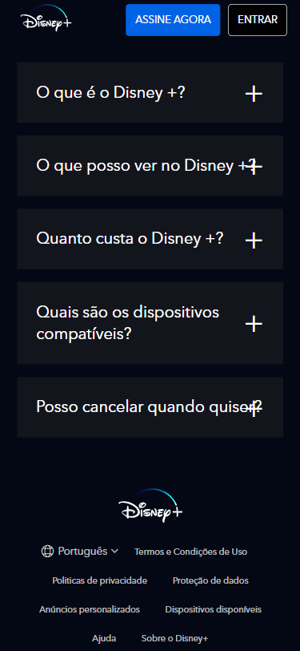

<div align="center">
  

  <h1>Disney+ Clone</h1>

  <p>
    Recreação fiel da landing page do Disney+ com integração à API real do TMDB,<br/>
    pipeline de build automatizado com Gulp, acessibilidade WCAG e deploy contínuo no Vercel.
  </p>

  <p>
    <a href="https://clone-disneyplus-mu-two.vercel.app">
      
    </a>
    
    
    
    
    
  </p>

  <br/>

  

  <sub><em>GIF gerado automaticamente com <code>npm run gif</code></em></sub>
</div>

---

## Screenshots

| Desktop | Tablet | Mobile |
|:---:|:---:|:---:|
|  |  |  |
|  |  |  |
|  |  |  |

---

## Destaques técnicos

- **TMDB API** — carrosséis populados com dados reais via proxy Vercel serverless (token nunca exposto no browser)
- **Pipeline Gulp** — compilação SCSS, minificação JS (Terser), optimização de imagens (Sharp), WebP automático, BrowserSync
- **Acessibilidade WCAG 2.1** — skip-to-content, ARIA completo, navegação por teclado, `prefers-reduced-motion`
- **CI/CD** — GitHub Actions com lint, html-validate, build e Lighthouse CI a cada push
- **Arquitectura SCSS 7-1** — abstracts, base, components, layout com design tokens documentados
- **JSON-LD Schema.org** — dados estruturados para SEO
- **Segurança** — zero credenciais no frontend; token TMDB em variável de ambiente Vercel

---

## Features

- Carrosséis dinâmicos com filmes reais ("Em Breve", "Mais Populares", "Star+") via TMDB
- Layout totalmente responsivo — mobile, tablet e desktop
- Secção de planos de subscrição com preços
- Lista de dispositivos compatíveis
- Accordion de FAQ interactivo com acessibilidade completa
- Header com comportamento dinâmico ao scroll
- Deploy automático no Vercel a cada `git push`

---

## Stack

| Tecnologia | Versão | Uso |
|---|---|---|
| HTML5 | — | Estrutura semântica + JSON-LD |
| SCSS | 1.x | Variáveis, mixins, arquitectura 7-1 |
| JavaScript | ES2017+ | Interactividade, fetch async/await |
| Gulp | 5.x | Build tool e automação de tasks |
| gulp-sass | 6.x | Compilação SCSS → CSS |
| gulp-autoprefixer | 8.x | Prefixos CSS cross-browser |
| gulp-clean-css | 4.x | Minificação CSS |
| gulp-sourcemaps | 3.x | Source maps para DevTools |
| gulp-terser | 2.x | Minificação JS com suporte ES2017+ |
| sharp | 0.34.x | Optimização de imagens + WebP |
| browser-sync | 3.x | Live reload em desenvolvimento |
| ESLint + Stylelint | — | Linting JS e SCSS |
| Prettier | 3.x | Formatação de código |
| html-validate | — | Validação HTML no CI |
| Puppeteer | 22.x | Screenshots automáticos |
| Vercel | — | Deploy, hosting e serverless functions |

---

## Arquitectura do projecto

```
clone_disneyplus/
├── api/
│   └── tmdb.js              ← Proxy serverless (token seguro no servidor)
├── src/
│   ├── scss/
│   │   ├── abstracts/       ← design tokens, mixins, functions
│   │   ├── base/            ← reset, typography, accessibility, themes
│   │   ├── components/      ← header, hero, shows, plans, faq, footer
│   │   ├── layout/          ← grid, image-text sections
│   │   └── main.scss        ← entry point (@use apenas)
│   ├── scripts/
│   │   └── main.js          ← TMDB fetch, tabs, FAQ accordion
│   └── images/
├── dist/                    ← gerado pelo Gulp
├── docs/screenshots/        ← gerado pelo script Puppeteer
├── scripts/
│   └── screenshot.js        ← screenshots automáticos com Puppeteer
├── .github/workflows/
│   └── build.yml            ← CI: lint → html-validate → build → Lighthouse
├── index.html
├── gulpfile.js
└── package.json
```

---

## Correr localmente

### Pré-requisitos

- Node.js >= 18.x
- npm >= 9.x

### Instalação

```bash
# 1. Clonar o repositório
git clone https://github.com/viniciussilva2504/clone_disneyplus.git
cd clone_disneyplus

# 2. Instalar dependências
npm install

# 3. Iniciar em modo desenvolvimento (com live reload)
npm run dev
```

O browser abre automaticamente em `http://localhost:3000`.

### Build de produção

```bash
npm run build
```

### Outros comandos

```bash
npm run lint          # JS + SCSS
npm run format        # Prettier em todos os ficheiros
npm run validate:html # Validação HTML
npm run screenshot    # Gera screenshots em docs/screenshots/
```

---

## Arquitectura SCSS 7-1

```
abstracts/   ← design tokens, mixins, functions
base/        ← reset global, tipografia, helpers de acessibilidade, temas
components/  ← um ficheiro por componente
layout/      ← grid e secções de imagem + texto
main.scss    ← apenas @use/@forward, sem CSS directo
```

**Design tokens:**
- Background: `#040714` — idêntico ao Disney+ original
- Primary: `#0063e5` — botões e CTAs
- Tipografia: Avenir / Helvetica Neue
- Breakpoints: `480px` · `768px` · `1024px`

---

## Acessibilidade

- Link skip-to-content para utilizadores de teclado
- `role`, `aria-label`, `aria-expanded`, `aria-controls` em todos os elementos interactivos
- `:focus-visible` em todos os elementos focáveis
- `prefers-reduced-motion` desactiva todas as transições/animações
- Navegação por teclado completa em tabs e FAQ (Enter / Espaço)
- Hierarquia semântica de headings
- Labels visualmente ocultos (`.sr-only`) para associação de formulários

---

## Aviso legal

Este projecto foi construído exclusivamente para fins educativos e de portfólio.
Todos os direitos relativos à marca Disney+ pertencem à The Walt Disney Company.

